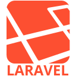

<h1 align="center">Hi 👋, I'm Gildas</h1>
<h3 align="center">A passionate developer from Paris</h3>

 <!--   -->

- 👨‍💻 I studied at **Épitech**

- 🔭 I’m currently working on **web projects**

- 🌱 I've worked with :

  - **JS (NestJS,Express,React)**
  - **PHP (Symfony,Laravel,Joomla,Drupal)**

- 💬 Ask me about it !

- 📫 How to reach me **[gildas.le-drogoff@epitech.eu](mailto:gildas.le-drogoff@epitech.eu)**

<h3 align="left">Languages and Tools :</h3>

  
  
  
  
  
  
  
  
  
  
  
  
  
  
  
  
  
  
  
  
  
  
  
  
  
  
  
      
  </a>
  

